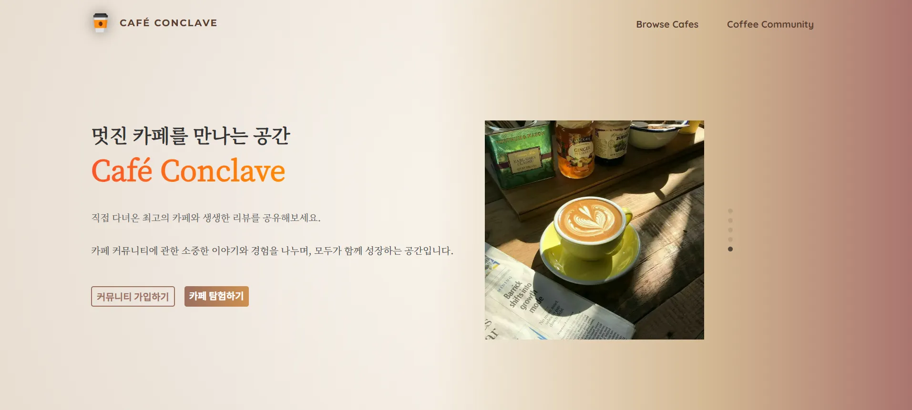
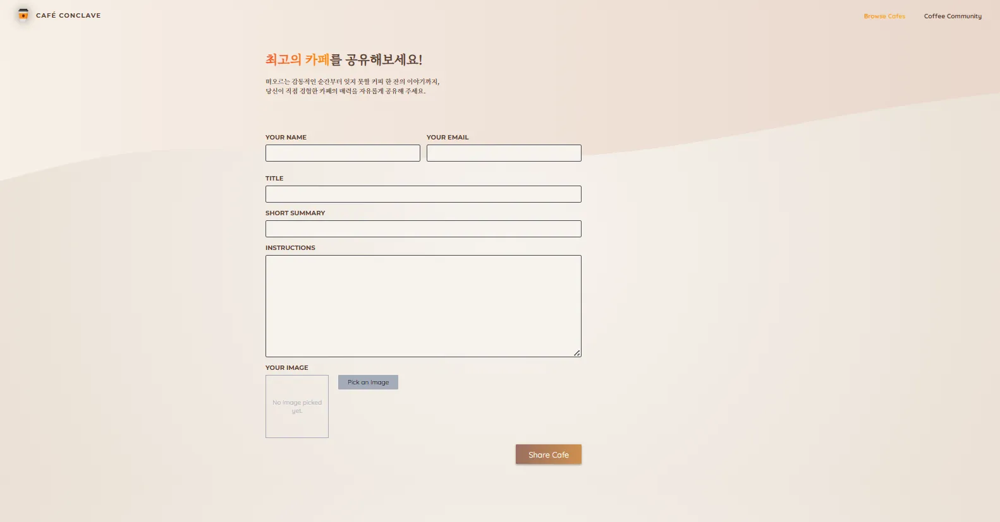
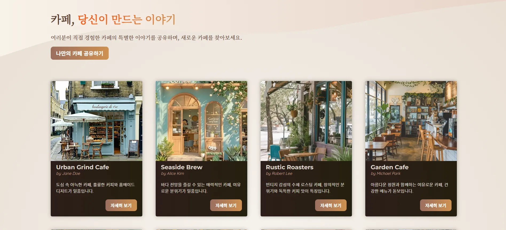

# Cafe-conclave
Next.js 14의 App Router 및 최신 기술 스택 학습을 목적

## 상세 내용

- **카페 등록 기능**
    - 이름, 설명, 대표 이미지 등을 입력하여 카페 정보를 등록
    - URL은 `slugify`를 통해 사람이 읽기 쉬운 slug 형식으로 생성
    - 이미지 파일은 **AWS S3**에 업로드하여 안정적으로 관리
- **카페 리스트 및 상세 페이지**
    - 등록된 카페 정보를 리스트 형태로 표시
    - 각 카페 상세 페이지에서 설명, 이미지 등 상세 정보 확인 가능
- **XSS 방지를 위한 보안 처리**
    - 사용자 입력값은 `xss` 패키지를 통해 필터링 처리
    - 보안 취약점을 사전에 방지하는 구조로 설계

---

## 주요 개발 내용

- **Next.js 14 기반의 풀스택 개발 학습 경험**
    - App Router, Server Component 등 최신 기능 중심으로 구성
    - CSR과 SSR의 조화를 고려한 페이지 구성 및 데이터 처리 경험
- **SQLite 기반 로컬 데이터베이스**
    - `better-sqlite3`를 이용하여 빠르고 간단한 데이터 저장소 구성
    - 게시글, 댓글, 태그, 사용자 등 주요 도메인 모델 직접 설계 및 구현
- **AWS S3 이미지 업로드 기능 구현**
    - `@aws-sdk/client-s3`를 이용하여 사용자가 업로드한 이미지 S3에 저장
    - 게시글 작성 시 이미지 업로드 → URL 반환 → 미리보기 구현
- **XSS 방지를 위한 사용자 입력 정제**
    - `xss` 패키지를 이용해 게시글 내용, 댓글 등의 입력값 필터링 처리
    - 보안 취약점 예방을 위한 최소한의 방어 구조 설계

---

## 기술 스택

| 분류 | 사용 기술 |
| --- | --- |
| **Frontend** | Next.js 14 |
| **Backend** | SQLite (better-sqlite3) |
| **Cloud** | AWS S3 (이미지 업로드 및 관리) |